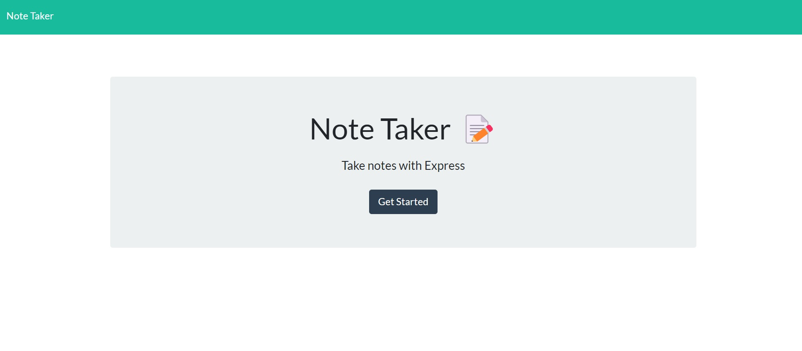
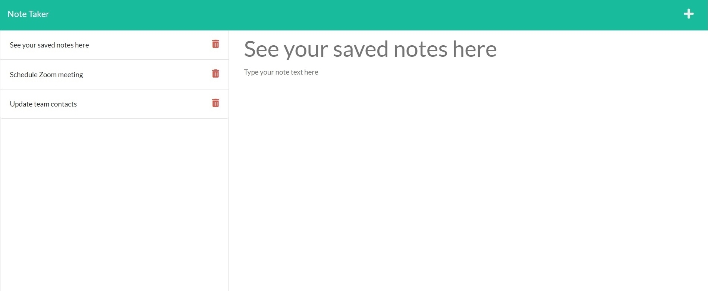

# Note Taker

## Description
This is a command-line application that enables the user to write and save notes. 
  

  ## Table of Contents
  - [Project Title](#note-taker)
  - [Description](#description)
  - [Installation](#installation)
  - [Usage](#usage)
  - [License](#license)

## Installation

No additional installation is necessary to use this app.
  
## Usage

To use the app, click the "Get Started" button. You will be redirected to the notes page, where you can enter your note title and any applicable text. When you click the "save" icon your note will be saved to the column on the left side of the page. A new note can be added by clicking the "add" icon. Your saved notes and text can be viewed by clicking on the saved note. 

The application can be accessed [here](https://guarded-bastion-50474.herokuapp.com/).

##### Landing page

 #####  Notes page

## License

This application is covered under [The MIT License](https://opensource.org/licenses/MIT). 

## Questions

GitHub:
<https://github.com/EvelynAguirreOrtiz>

Please send requests for additional information to:
<evelyn.aguirre.9895@gmail.com>
